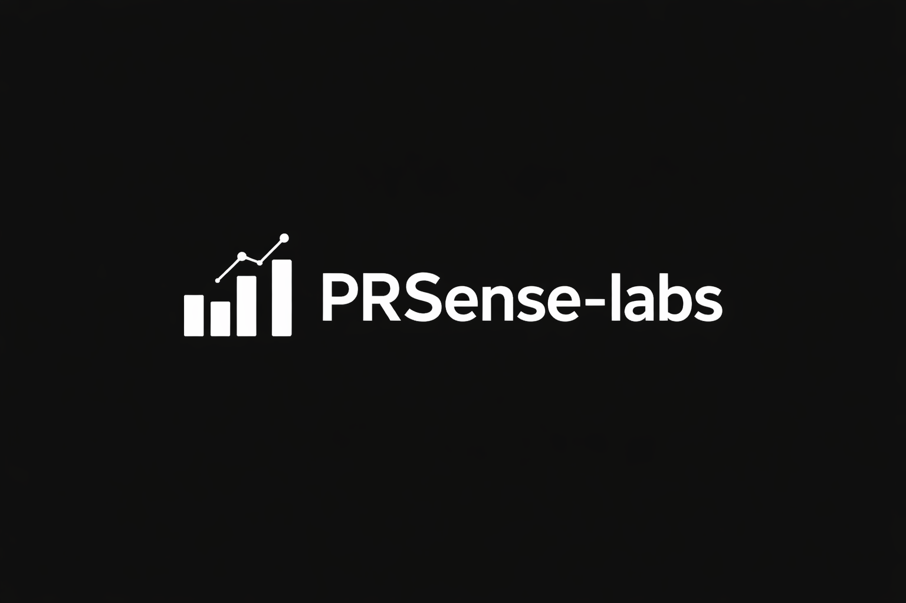

  
  <h1>PRSense Labs</h1>
  
The omniscient memory engine for your repositories.

  

    <a href="https://prsense.dev">Website</a> &nbsp;・&nbsp;
    <a href="https://prsense.dev/docs">Documentation</a> &nbsp;・&nbsp;
    <a href="https://github.com/prsense-labs">Community</a>
  

   

## Mission 

**Build trustworthy tools that give repositories memory — reducing duplicate work while preserving contributor credit.** 

PRSense Labs provides the infrastructure to stop redundant engineering execution. We build the semantic memory layer that connects your global engineering teams, preventing duplicate Pull Requests before they are merged.

---

## Featured Projects

| Repository | Description | Status |
| :--- | :--- | :--- |
| **[prsense](https://github.com/prsense-labs/prsense)** | The core semantic engine and CLI for PR duplicate detection. | `Stable` |
| **[prsense-vscode](https://github.com/prsense-labs/prsense-vscode)** | Real-time duplicate PR detection inside Visual Studio Code. | `Beta` |
| **[prsense-analytics](https://github.com/prsense-labs/prsense-analytics)** | Enterprise tracking for maintainer efficiency and PR overlap. | `Alpha` |

---

## Engineered for Scale

* **Repository Memory Engine**: Vector-index every PR, issue, and discussion to provide instant, organization-wide semantic recall.
* **Instant CI/CD Blocking**: Block duplicate engineering natively inside your Pull Request status checks before code is merged.
* **Automated Risk Triage**: Dynamically score PR impact and route complex architectural changes to the original authors.
* **Enterprise BYOK Security**: Bring Your Own Key or use local ONNX node embeddings. We never train on your proprietary codebase.
* **Cross-Repo Radar**: Detect overlapping work not just in one project, but across your entire global organization.

---

## Ecosystem

Choose the integration that natively fits your engineering workflow:

* **CI/CD** (GitHub Action): Surfaces relevant history on every PR automatically.
* **Local Dev** (VS Code): Recall history while you type in your local environment.
* **Terminal** (CLI): Index and query your repo directly via npm.
* **Microservice** (Docker): Run as a standalone REST API.

---

## Open Source Philosophy

**PRSense is an Enforcer, not a coding assistant.** 

We do not generate code. We do not judge syntax or formatting rules. We strictly map semantic engineering flow, automate high-risk triage, and detect architectural drift. Your engineering history never leaves your VPC to train public foundational models.

 

  Copyright © 2026 PRSense Labs. Open Source. Developer First.

